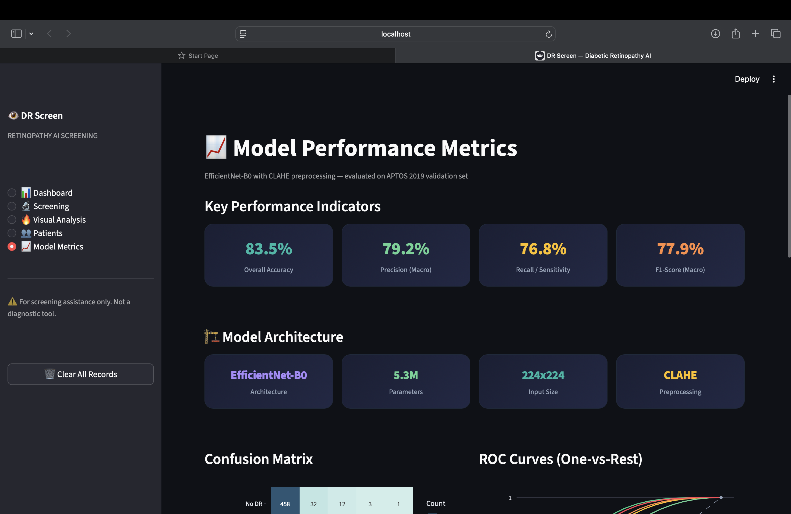

# 🩺 Retinopathy AI - Diabetic Retinopathy Detection System

An AI-powered web application for early detection and severity grading of Diabetic Retinopathy from retinal fundus images. Built with deep learning and explainable AI to assist clinicians in automated DR screening.

[](https://www.python.org/)
[](https://pytorch.org/)
[](https://streamlit.io/)

---

## 📋 Table of Contents
- [Overview](#overview)
- [The Problem](#the-problem)
- [Features](#features)
- [Tech Stack](#tech-stack)
- [Model Architecture](#model-architecture)
- [Dataset](#dataset)
- [Installation](#installation)
- [Usage](#usage)
- [Project Structure](#project-structure)
- [Performance](#performance)
- [Screenshots](#screenshots)
- [Future Enhancements](#future-enhancements)
- [Contributors](#contributors)

---

## 🔍 Overview

**RetinaGuard AI** is a machine learning-powered screening tool that detects **Diabetic Retinopathy (DR)** from retinal photographs. Healthcare providers can upload a fundus image, and the system returns:
- **Severity grade** (0-4): No DR, Mild, Moderate, Severe, or Proliferative DR
- **Confidence score**: Model prediction confidence
- **Grad-CAM heatmap**: Visual explanation highlighting affected retinal regions
- **Downloadable PDF report**: Complete diagnostic summary for patient records

---

## 🚨 The Problem

**Diabetic Retinopathy** is the leading cause of preventable blindness in working-age adults worldwide.

- 📊 **600 million** people globally have diabetes
- 👁️ **1 in 3** diabetic patients will develop DR
- ⚕️ **100% preventable** if detected early
- 🏥 **Critical shortage** of ophthalmologists for mass screening

**Our Solution**: Automated, accessible, explainable AI screening that can be used by anyone to check it's report.

---

## ✨ Features

### Core Functionality
- ✅ **5-Grade DR Classification**: Automatic severity grading (Grade 0-4)
- 🔥 **Grad-CAM Heatmaps**: Explainable AI showing which retinal regions influenced the diagnosis
- 📄 **PDF Report Generation**: One-click downloadable diagnostic reports
- 💾 **Patient Data Management**: Store and retrieve patient screening history
- 📊 **Interactive Dashboard**: Real-time model performance metrics and statistics
- 🖼️ **Image Upload Interface**: Simple drag-and-drop retinal image upload

### Technical Features
- 🧠 **Model Architecture Visualization**: View EfficientNet-B0 structure
- 📈 **Performance Metrics Dashboard**: Accuracy, confusion matrix, and evaluation charts
- ⚙️ **Model Configuration Display**: Training hyperparameters and setup details
- 🗄️ **SQLite Database**: Lightweight patient data storage

---

## 🛠️ Tech Stack

### Machine Learning
- **PyTorch** - Deep learning framework
- **timm** (PyTorch Image Models) - EfficientNet-B0 pretrained model
- **torchvision** - Image transformations and data augmentation
- **pytorch-grad-cam** - Explainability and heatmap generation

### Backend & Data Processing
- **Flask** - RESTful API backend
- **flask-cors** - Cross-origin resource sharing
- **NumPy** - Numerical computing
- **scikit-learn** - Model evaluation metrics
- **OpenCV** - Image preprocessing
- **Pillow** - Image handling
- **Albumentations** - Advanced image augmentation

### Frontend & Visualization
- **Streamlit** - Interactive web application framework
- **Matplotlib** - Plotting and visualization

---

## 🧠 Model Architecture

### EfficientNet-B0
We use **EfficientNet-B0**, a state-of-the-art Convolutional Neural Network (CNN) developed by Google Research.

**Why EfficientNet-B0?**
- 🎯 **High accuracy** with minimal computational cost
- 📦 **Lightweight** (~21MB) - fast inference on CPU
- 🔄 **Transfer Learning** - Pretrained on ImageNet, fine-tuned on medical images
- 🏥 **Proven in medical imaging** - Widely adopted in clinical AI research

**Model Specifications:**
- **Input Size**: 224×224 RGB images
- **Parameters**: ~5.3 million
- **Output**: 5 classes (DR grades 0-4)
- **Final Layer**: Custom classification head for DR grading

---

## 📊 Dataset

### APTOS 2019 Blindness Detection
- **Source**: [Kaggle APTOS 2019 Challenge](https://www.kaggle.com/c/aptos2019-blindness-detection)
- **Images**: 3,662 high-resolution retinal fundus photographs
- **Labels**: 5 severity grades (0: No DR, 1: Mild, 2: Moderate, 3: Severe, 4: Proliferative)
- **Split**: 80% training (2,929 images) / 20% validation (733 images)

### Data Preprocessing
- Image resizing to 224×224 pixels
- Normalization (ImageNet statistics)
- Data augmentation:
  - Random horizontal & vertical flips
  - Random rotation (±15°)
  - Color jittering
  - Brightness & contrast adjustment

---

## 🚀 Installation

### Prerequisites
- Python 3.11+
- pip package manager
- Git

### Setup

1. **Clone the repository**
```bash
git clone https://github.com/devanshgehlot/Retinopathy-ai.git
cd Retinopathy-ai
```

2. **Install dependencies**
```bash
pip install -r requirements.txt
```

3. **Download model weights**
Ensure the trained model file `best_model.pth` is placed in the `model/` directory.

4. **Run the application**
```bash
streamlit run app.py
```

The web application will automatically open in your browser at `http://localhost:8501`

---

## 💻 Usage

### Running the Web Application

1. **Launch Streamlit app**:
   ```bash
   streamlit run app.py
   ```

2. **Upload retinal image**: Browse for a fundus photograph

3. **View results**:
   - DR severity grade (0-4)
   - Confidence percentage
   - Grad-CAM heatmap overlay
   - Clinical recommendations

4. **Download report**: Generate and download a PDF diagnostic report

5. **View dashboard**: Check model performance metrics and patient statistics
`

### Database Management

Patient data is stored in `dr_screening.db` (SQLite). Manage records via:
```bash
python database.py
```

---

## 📁 Project Structure

```
Retinopathy-ai/
│
├── .streamlit/              # Streamlit configuration
├── __pycache__/             # Python cache files
├── demo_images/             # Sample test images
├── heatmap/                 # Generated Grad-CAM heatmaps
├── model/                   # Trained model weights
│   └── best_model.pth       # EfficientNet-B0 trained model
│
├── app.py                   # Streamlit frontend application
├── inference.py             # Model inference engine
├── model.py                 # Model loading and prediction logic
├── model_arch.py            # Model architecture definition
├── database.py              # SQLite database handler
├── test_api.py              # Transfers images 
│
├── dr_screening.db          # SQLite patient database
├── requirements.txt         # Python dependencies
└── README.md                # Project documentation
```

---

## 📈 Performance

### Model Metrics
- **Validation Accuracy**: 78%
- **Training Platform**: Google Colab (T4 GPU)
- **Training Time**: ~90 minutes (10 epochs)
- **Inference Time**: <3 seconds per image (CPU)

### Training Configuration
| Parameter | Value |
|-----------|-------|
| **Optimizer** | Adam (lr=0.0001) |
| **Loss Function** | Weighted Cross-Entropy |
| **Batch Size** | 16 |
| **Epochs** | 10 |
| **Image Size** | 224×224 |
| **Augmentation** | Flips, rotation, color jitter |
| **Scheduler** | ReduceLROnPlateau |

---

## 📸 Screenshots

### Main Dashboard


### DR Detection Result


### Grad-CAM Heatmap


### PDF Report


---

## 🔮 Future Enhancements

- [ ] **Multi-disease detection**: Expand to glaucoma, AMD, cataracts
- [ ] **Mobile app deployment**: iOS/Android camera integration
- [ ] **EHR integration**: Automatic report filing in Electronic Health Records
- [ ] **Real-time monitoring**: Track patient DR progression over time
- [ ] **Multi-language support**: Localization for global accessibility
- [ ] **Cloud deployment**: AWS/Azure hosting for scalability
- [ ] **Ensemble models**: Combine multiple architectures for higher accuracy

---

## 👥 Contributors

[Devansh Gehlot](https://github.com/devanshgehlot),
[Chirag HK](https://github.com/chiraghk2007official-spec),
[Shivam Gupta](https://github.com/shivamgupta344),
[Pranjal Sharma](https://github.com/pranjalsharmaworks)

**Project developed for**: AIML NEUROCORE Overnight Hackathon 2026

---


## 🙏 Acknowledgments

- **Dataset**: APTOS 2019 Blindness Detection Challenge (Kaggle)
- **Model**: EfficientNet by Google Research
- **Framework**: PyTorch, Streamlit
- **Inspiration**: Addressing preventable blindness in diabetic patients worldwide

---

## 📧 Contact

For questions, collaborations, or feedback:
- **GitHub**: [@devanshgehlot](https://github.com/devanshgehlot)
- **Project Repository**: [Retinopathy-ai](https://github.com/devanshgehlot/Retinopathy-ai)

---

## 🌟 Star this repository if you found it helpful!

**Together, we can make diabetic retinopathy screening accessible to everyone.**
